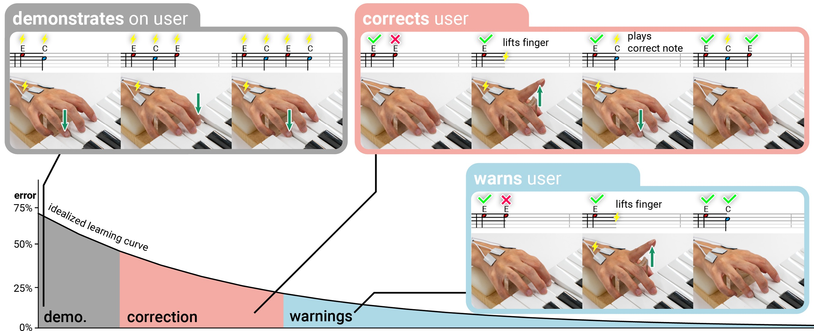

# Yun Ho | HCI PhD student

[CV  ](https://drive.google.com/file/d/1seiBc8jvrxh-K9OGOiQ46J4EmxEAjkUj/view?usp=sharing)      [Google Scholar  ](https://scholar.google.com/citations?user=Rv2Z0EoAAAAJ&hl=en)      [Twitter  ](https://twitter.com/yun_yh_?s=21)      [LinkedIn  ](https://www.linkedin.com/in/yun-ho-78055b257?utm_source=share&utm_campaign=share_via&utm_content=profile&utm_medium=ios_app)

I am a second-year Computer Science PhD student at the University of Chicago, advised by [Professor Pedro Lopes](http://lab.plopes.org).

My research focuses on Human-Computer Interaction. I play with body movements and perceptions, and I am curious about how people feel when a device **moves you**.

I have a background in psychology. Aside from HCI, I love dancing and [photography](https://www.instagram.com/flattenedcopy?utm_source=ig_web_button_share_sheet&igsh=ZDNlZDc0MzIxNw==).

## Publications
### Adaptive Electrical Muscle Stimulation Improves Muscle Memory
Siya Choudhary\*, Romain Nith\*, **Yun Ho\***, Jas Brooks, Mithil Guruvugari, Pedro Lopes. CHI'25 (full paper)

[CHI'25 paper](https://lab.plopes.org/published/2025-CHI-AdaptiveEMS.pdf), [video](https://www.youtube.com/watch?v=VqqpRu269QE)

Electrical muscle stimulation (EMS) can assist in learning motor skills. However, existing EMS systems provide static demonstration—actuating the correct movements, regardless of the user’s learning progress. Instead, we propose a novel adaptive-EMS that changes its guidance strategy based on the participant’s performance. The adaptive-EMS dynamically adjusts its guidance: (1) demonstrate by playing the entire sequence when errors are frequent; (2) correct by lifting incorrect fingers and actuating the correct one when errors are moderate; and (3) warn by lifting incorrect fingers when errors are low. We found that adaptive-EMS improved learning outcomes (recall) compared to traditional EMS—leading to improved “muscle memory.”

### SplitBody: Reducing Mental Workload while Multitasking via Muscle Stimulation
Romain Nith, **Yun Ho**, Pedro Lopes. In Proc. CHI'24 (full paper)

Best Paper Award (top 1%) 

[CHI'24 paper](https://dl.acm.org/doi/full/10.1145/3613904.3642629), [video](https://www.youtube.com/watch?v=J4tJ1FZ-QoA)

Techniques like electrical muscle stimulation (EMS) offer promise in assisting physical tasks by automating movements. However, existing actuation systems improve the performance of a task that users are **already focusing on**. Instead, we investigate whether these interactive-actuation systems (e.g., EMS) offer any benefits if they automate a task that happens in the **background** of the user's focus. In our study, participants performed a cognitively-demanding **multitask aided by EMS (SplitBody condition)** or performed by themselves (baseline). We found that with SplitBody performance increased (35% on both tasks, 18% on the non-EMS-automated task), physical-demand decreased (31%), and mental-workload decreased (26%).

### GazePrompt: Enhancing Low Vision People's Reading Experience with Gaze-Aware Augmentations
Ru Wang, Zach Potter, **Yun Ho**, Daniel Killough, Linxiu Zeng, Sanbrita Mondal, Yuhang Zhao. In Proc. CHI'24 (full paper)

[CHI'24 paper](https://dl.acm.org/doi/pdf/10.1145/3613904.3642878)

Reading is a challenging task for low vision people. While conventional low vision aids (e.g., magnification) offer certain support, they cannot fully address the difficulties faced by low vision users, such as **locating the next line and distinguishing similar words**. To fill this gap, we present GazePrompt, a gaze-aware reading aid that provides timely and targeted visual and audio augmentations based on users’ gaze behaviors. GazePrompt includes two key features: (1) a Line-Switching support that highlights the line a reader intends to read; and (2) a Difficult-Word support that magnifies or reads aloud a word that the reader hesitates with. We found that GazePrompt significantly **reduced participants’ line switching time, reduced word recognition errors, and improved their subjective reading experiences**.

