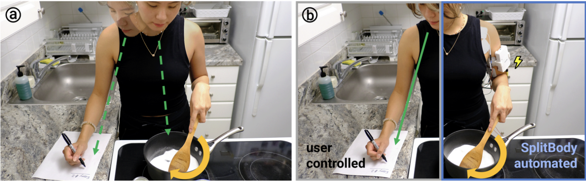
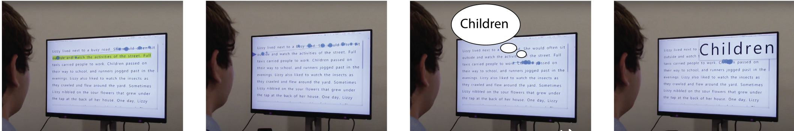

# HCI|body movement|perceptions

## About
Hello! My name is Yun. I am a first-year Computer Science PhD student at the University of Chicago, advised by [Professor Pedro Lopes](http://lab.plopes.org).

My research focuses on Human-Computer Interaction. I play with body movements and perceptions, and I am curious about how people feel when a device **moves you**.

## Publications
### SplitBody: Reducing Mental Workload while Multitasking via Muscle Stimulation
Romain Nith, Yun Ho, Pedro Lopes. In Proc. CHI'24 (full paper)
[CHI'24 paper](https://dl.acm.org/doi/full/10.1145/3613904.3642629)  [video](https://www.youtube.com/watch?v=J4tJ1FZ-QoA)

Techniques like electrical muscle stimulation (EMS) offer promise in assisting physical tasks by automating movements. However, existing actuation systems improve the performance of a task that users are **already focusing on**. Instead, we investigate whether these interactive-actuation systems (e.g., EMS) offer any benefits if they automate a task that happens in the **background** of the user's focus. In our study, participants performed a cognitively-demanding **multitask aided by EMS (SplitBody condition)** or performed by themselves (baseline). We found that with SplitBody performance increased (35% on both tasks, 18% on the non-EMS-automated task), physical-demand decreased (31%), and mental-workload decreased (26%).

### GazePrompt: Enhancing Low Vision People's Reading Experience with Gaze-Aware Augmentations
Ru Wang, Zach Potter, Yun Ho, Daniel Killough, Linxiu Zeng, Sanbrita Mondal, Yuhang Zhao. In Proc. CHI'24 (full paper)
[CHI'24 paper](https://dl.acm.org/doi/pdf/10.1145/3613904.3642878)

Reading is a challenging task for low vision people. While conventional low vision aids (e.g., magnification) offer certain support, they cannot fully address the difficulties faced by low vision users, such as **locating the next line and distinguishing similar words**. To fill this gap, we present GazePrompt, a gaze-aware reading aid that provides timely and targeted visual and audio augmentations based on users’ gaze behaviors. GazePrompt includes two key features: (1) a Line-Switching support that highlights the line a reader intends to read; and (2) a Difficult-Word support that magnifies or reads aloud a word that the reader hesitates with. We found that GazePrompt significantly **reduced participants’ line switching time, reduced word recognition errors, and improved their subjective reading experiences**.

